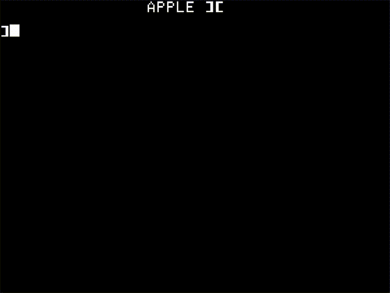

# Apple ][+ Emulator  
This is an Apple ][+ emulator written in "C" using SDL and the Nuklear immediate mode GUI.  The emulator has a cycle correct 6502 CPU (does not support undocumented opcodes), a Language Card and a SmartPort block device.  No Disk II support.  
  
This configuration makes it possible to boot and run Total Replay or other ProDOS disk volumes.  


  
## Starting the emulator  
All that's needed is the apple2 executable.  There are a few optional files.  The first is apple2.ini.  The ini file is used to specify which slots contain a SmartPort interface, and what disks are mounted as devices 0 & 1 on the interface.  Optionally, a boot parameter can also be given, which will boot the disk0 image.  Here's an example ini file.  
```
; Use this file to configure the slots on the Apple ][
[smartport]
slot = 7                    ; This says a slot contains a smartport
disk0 = ./disks/master.po   ; Path to a disk for device0 (called disk0 in here)
disk1 = ./disks/Total Replay v5.2.hdv
boot = yes                  ; optional and any value other than 0 will cause a boot of disk0
```  
Multiple slots can be assigned a SmartPort.  If boot turned on for more than one slot, the last slot it was turned on for will be the one that is booted.  
Note:  The path names are _not_ enclosed in quotation marks.  
  
The emulator can also load symbol files.  It will look in a folder called symbols for these files:  
```
    A2_BASIC.SYM
    APPLE2E.SYM
    USER.SYM
```  
The A2_BASIC.SYM and APPLE2E.SYM were taken from `AppleWin`.  The USER.SYM is, as the title suggests, a symbol file with symbols that the user creates.  If these files are not found, they are silently ignored.  They are loaded in the order listed.  APPLE2E.SYM will not replace symbols defined in A2_BASIC.SYM, but USER.SYM will replace symbols found in either of the previous 2 symbol files.  The format of these files are that any line not starting, on the left margin, with a hex number, are ignored. Lines that start with hex numbers have the rest of the line defined as a symbol, at the address of the HEX number the line started with.  Here's a sample from my Manic Miner game:  
```
007338 read
0072C0 screenDrawSprite
0072B1 screenDrawSprites
00669F collapseDraw
0066A7 allDrawn
006657 setupSwitch
```  
This USER.SYM file is generated for me by transforming the ca65 output using this SED command:  
```
sed "s/^al \([[0-9A-F]\+\)\ \./\1 /g" $(NAME).apple2.lbl > USER.SYM
```  
  
## Using the emulator  
When the emulator starts, it starts as a 1120 x 840 window that shows the Apple ][+ screen.  If not booting a SmartPort disk, the emulator will be in Applesoft BASIC.  Remember to activate CAPS LOCK since, for example cursor controls, require uppercase letters to work.  

The function keys all go to the emulator (or maybe call it the debugger) rather than to the Apple ][+ machine.  All other keys go to the Apple ][+ machine, while the machine is not stopped.  This is what the function keys do:  
```
F1 - Help (coming soon! ;)
F2 - Toggle debugger display ON/OFF
F3 - Toggle Speed Limiter (Run at 1MHZ vs as fast as possible) 
These keys only work when the Apple ][+ is stopped:
F5 - Run (Go - exit stopped mode)
F6 - Run to cursor
F9 - Toggle breakpoint at PC
F10 - Step (over)
F11 - Step (into)
F11 + SHIFT - Step (out)
F12 - Toggle between Color and B&W display (monitor) mode
```
  
## The window layout when debugger is visible  
Opening the debugger display (F2) shows these windows:  
```
CPU - Shows the Program Counter (PC), Stack Pointer (SP), registers and flags.
Disassembly - Shows the program stream currently executing
Memory - Shows a page of RAM in HEX and ASCII
Miscellaneous
  Shows the SmartPort devices
  Debugger status and breakpoints
  Display status (text, lowres or HGR and active page)
```
  
## Using the debugger  
While the machine is running (not stopped), the debug windows, if visible, all update (attempts to update at 60 FPS) but user control only applies to the emulated machine (the Apple ][+).  Once the machine is stopped, the windows can be interacted with.  Which window receives input is controlled by mouse hover.  The title of the "active window" will be shown in green.  (Note: I don't know Nuklear well enough to establish an "active window" so the mouse needs to stay over a window for that window to remain the active window - not ideal but that's how it currently works).  
  
## Using the CPU window  
The CPU window, when stopped, has edit boxes for the PC, SP, registers and flags.  To edit any of this, click in the box (make sure the mouse pointer stays over the CPU window) and type in a new value.  make the value effective by pressing ENTER.  
  
## Using the Disassembly window  
The following keys work in the disassembly window.  
```
CTRL-g - Brings up a modal dialog to set the address for where to view disassembly (cursor PC)
CTRL-p - Set the machine PC to the cursor PC 
TAB - Toggle the symbol display between all / functions and labels / labels / none
CURSOR - UP, DOWN - Move the cursor PC up/down an address (line)
PAGE UP/DOWN - (Try to) move the cursor PC up/down a page
```
  
## Using the Memory window  
The address where the cursor is, is shown in the very last line of the window.  Editing memory edits at that address.  
```
CTRL-f - Modal find dialog, search for strings or HEX "strings"
CRTL-g - Modal go to address dialog
CTRL-j - Join a split window with the one below
CTRL-SHIFT-j - Join a split window with the one above
CTRL-n - Find next (forward) (using same prev search from CTRL-f)
CTRL-SHIFT-n - Find prev (backwards) (using same prev search from CTRL-f)
CTRL-s - Split the memory display (up to 16 times) to make virtual memory windows
CTRL-t - Toggle between editing the HEX or the ASCII memory at the cursor location
ALT-0 through ALT-f - Select the virtual memory window (made with CTRL-S)
```  
Since there is only one memory window, I decided to make it possible to split it on any line.  So, pressing CTRL-s on any line other than the top line of any virtual window, will make a "split" at that line.  This changes the color of the virtual window, and it also sets the first digit on the line to the ID of this virtual window.  This might look like:  
```
0:0000:...
0:0010:...
1:0020:...
```  
The 0: and 1: regions now act like windows for scrolling, page up/down, go to, etc.  This makes it possible to set up multiple areas to watch.  Use ALT and the 1st digit on the line to activate that virtual window and CTRL-(shift-)j to join a window (unsplit) with its neighbor.  
  
Type HEX digits in to edit the memory in HEX mode and use any key to edit the memory in ASCII mode (switch using CTRL-t).  
  
## Using the Miscellaneous window  
This window currently has 3 sections.  Each section can be shown/hidden by clicking on the triangle before the section name.  NOTE:  These sections only respond to input when the emulator is stopped.  
### SmartPort  
This shows which slot has a SmartPort interface.  In each slot, slot 0 display (example `7.0`) is a button.  Pressing that button will just immediately boot disk0 (if mounted).  The `Eject` button "removes" the disk from the slot and the `Insert` button brings up a file browser through which a disk can be mounted.  Note: Selecting a file that is not a disk image will work as _no_ validation is done.  The only check is if a file has `2IMG` in the header, the offset for the start in the file is set to 64 bytes from the start of the file (ignoring/skipping the header).  
This section is populated based on the apple2.ini file.  Making changes in the UI will _not_ update the apple2.ini file.  At the moment, this file needs to be edited by hand.  
### Debugger  
The status display shows:  
`Run to PC O XXXX`.  While the emulator is "running to the address XXXX" the `O` is lit.  It is just sometimes good to know that stepping over a `JSR` for example, is in progress.  `Step Out O` similarly is active when using SHIFT-F11 and the function doesn't "step out" quickly.  The Step Cycles show the number of cycles that elapsed from the emulator being stopped, till stopped again. So, if the emulator just stepped over a 2-cycle opcode using F11, that will show 2.  This is very handy for profiling since stepping over a `JSR` subroutine shows the all-inclusive number of cycles it took to run the routine.  Total cycles show the number of cycles executed since the start.  This number will roll over fairly quickly (minutes, not days of running the emulator).  
Setting a breakpoint (Using `F9`) will add additional rows:  
`XXXX` `Disable` `View PC` `Clear` and if multiple breakpoints are set `Clear All`.  These are:
`XXXX` The address at which the breakpoint is set.  
`Disable` will disable the breakpoint and the button will read `Enable` to re-enable the breakpoint.  
`View PC` will set the cursor PC to the address of the breakpoint.  
`Clear` will erase the breakpoint.  
`Clear All` will erase all breakpoints.  
### Display  
Display mode shows which of the `Text`, `Lowres` or `HGR` display modes is active.  `Mixed Mode` off indicates that the whole screen (in lores or HGR) is in that graphics mode, and `ON` shows that the last 4 "lines" of the display is shown in `Text` mode.  `Display page` indicates where from memory the display is showing what it is showing:  
```
Text: Page 0 = $0400, Page 1 = $0800
Lowes: Same as Text
HGR: Page 0 = $2000, Page 1 - $4000
```  
`Override Yes` allows changing the values above to see non-active modes and pages.  This is especially useful when looking at how a program draws off-screen if it does page-flipping.  `Override No` restores the hardware view of the display.  
These settings can only be altered when stopped, but stepping or running with `Override On` will keep the override settings.  
  
## Building from source  
If I get a chance, I will rework this section, but for now, you are more or less on your own.  On Windows I installed SDL2 and SDL_mixer, and I use VS Code with the cmake and cmake tools plugins.  On Linux (WSL), I installed SDL2 and mixer from source, which had all sorts of dependencies, but that's the only way I got the `find_package` scripts to show up.  I also use VS Code and plugins on Linux, and I used clang.  I don't have access to a Mac as I write this, so I am not sure if that will work on a Mac now.  
  
## The source files and what they do  
File | Description 
--- | --- 
6502.c | Cycle accurate 6502 implementation
apple2.c | Apple ][+ hardware config & softswitch implementation
breakpnt.c | Breakpoints.  Currently it only breaks on PC and run to or step out
dbgopcds.c | Arrays for disassembly printing of opcodes
dynarray.c | Dynamic arrays
header.h | One header file to include all needed header files
main.c | Define the Apple ][+ machine and view (Display) and main emulation loop
nuklear.h | GUI - see header (Modified very slightly for text background coloring)
nuklrsdl.h | SDL draw of Nuklear GUI - comes with nuklear.h
ramcard.c | Language card
roms.c | Apple ][+, Smartport & character ROMS.  Also Disk II (unused).
sftswtch.h | Addresses where the emulator cares about soft switches
smrtprt.c | SmarPort block device
util.c | File and folder utilities, ini parser, etc.
viewapl2.c | HGR & Lowres drawing - view the Apple ][+ screens
viewcpu.c | Key and display handling of CPU window
viewdbg.c | Key and display handling of disassembly window
viewdlg.c | Modal dialog implementations
viewmem.c | Key and display handling of memory window
viewmisc.c | Key and display handling of the miscellaneous window
viewport.c | SDL2 initialization and manage all the other views, update the display
  
## Known issues  
The Audio (speaker) might now work very well.  This is because I don't really know how to properly use SDL Audio.  It works very well on my Desktop PC and works okay on my laptop.  It stops working well when I use F3 to run the emulator at maximum speed.  
The language card implementation has an issue that I will try to track down, but it does not prevent most (or maybe all - I didn't test exhaustively) of Total Replay from working.  Some software, such as Orca/M and Program Writer don't work.  This may be because I have 65C02 versions, or because of my LC issues, or because I don't emulate quite enough of the Apple ][+ to make this software work.  At some point I may investigate.  
The cleanup on exit (freeing memory that was malloc'd) isn't all there.
There may be numerus other bugs, I have not thoroughly tested.  

## Future plans  
Apart from fixing the LC bug and maybe adding some more breakpoint types, It would be fairly straight forward, I think, to keep track of the APPLE2 struct in an array, with deltas to memory.  That will make "time travel" easy and efficient.  I might attempt that.  I don't really have plans to add Disk II.  This all came about because I wanted to see if I could do a 6502 that can run the harte tests, and from that I realized I could probably do a small emulator that can run my Manic Miner for the Apple II in 6502, and from that I decided to make the whole emulator.  But, my real passion is actually making games so I want to get back to that.
  
## Thank you  
* Brendan Robert - Author of Jace, for telling me how to think about sampling for speaker emulation.  
* Oliver Schmidt for, basically, teaching me all I know about the Apple II, but in this case showing me how easy it is to do SmartPort emulation.  
  
## Initial revision  
This initial revision was made in London, UK, on 31 October 2024.  
  
## Contact  
Stefan Wessels  
swessels@email.com  
